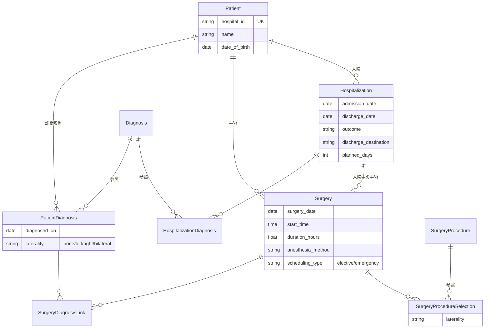

# Altocumulus

[](https://github.com/studiome/altocumulus/actions/workflows/ci.yml)
[](.ruby-version)
[](Gemfile)
[](LICENSE)

診療科単位で使う、患者・診断・手術・入院の診療台帳アプリケーション。
外来から病棟までの記録を 1 か所にまとめ、**手術枠（elective slot）の消化状況**と
**全変更の監査ログ**を可視化することに重点を置いています。

Rails 8.1 の標準構成（Propshaft + importmap + Turbo/Stimulus）だけで作られており、
Node のビルドパイプラインも外部の DB サーバーも必要ありません。

---

## 目次

- [主な機能](#主な機能)
- [技術スタック](#技術スタック)
- [セットアップ](#セットアップ)
- [開発コマンド](#開発コマンド)
- [ドメインモデル](#ドメインモデル)
- [設計上のポイント](#設計上のポイント)
- [テスト](#テスト)
- [デプロイ](#デプロイ)
- [開発ルール](#開発ルール)
- [ライセンス](#ライセンス)

---

## 主な機能

| 機能 | 画面 | 概要 |
| --- | --- | --- |
| 患者台帳 | `/patients` | 患者基本情報の管理。氏名・患者 ID でのキーワード検索、ページネーション対応 |
| 患者診断 | `/patients/:id/patient_diagnoses` | 診断マスタを参照した患者ごとの診断履歴。診断日と左右区分（laterality）を保持 |
| 手術記録 | `/surgeries` | 手術日・術式（最大 5 件）・麻酔法・所要時間・予定/緊急区分。患者診断および入院と紐付け |
| 入院記録 | `/hospitalizations` | 入院日/退院日・転帰・退院先・病室希望。診断は 1 件以上必須 |
| 手術枠スケジュール | `/surgery_schedule` | 週表示のカレンダー。枠の消化数・超過・時間超過・祝日を警告表示 |
| ダッシュボード | `/dashboard` | 年次で絞り込める統計（患者数・在院患者数・月別件数・平均在院日数・術式ランキング） |
| 監査ログ | `/audit_events` | 患者・手術・入院の作成/更新/削除を、変更前後の値つきで記録・閲覧 |
| マスタ管理 | `/diagnoses` `/surgery_procedures` `/elective_slot_rules` `/holidays` | 診断名・術式・曜日別の手術枠ルール・祝日 |

認証機構は含まれていません（院内ネットワーク内での利用を想定）。

## 技術スタック

| 領域 | 採用技術 |
| --- | --- |
| 言語 / フレームワーク | Ruby 4.0.6 / Rails 8.1 |
| データベース | SQLite（アプリ本体・Solid Queue・Solid Cache・Solid Cable の 4 スキーマ） |
| バックグラウンド処理 | Solid Queue / Solid Cache / Solid Cable |
| アセット | Propshaft + importmap-rails（**Node / バンドラ不使用**） |
| CSS | Tailwind CSS + daisyUI（`tailwindcss-rails`） |
| フロントエンド | Hotwire（Turbo Drive / Turbo Streams / Stimulus） |
| テスト | Minitest + fixtures、システムテストは Capybara + Selenium |
| 静的解析 | RuboCop（`rubocop-rails-omakase`）、Brakeman、bundler-audit、importmap audit |
| デプロイ | Kamal + Thruster（Dockerfile 同梱） |

## セットアップ

前提: Ruby 4.0.6（`.ruby-version` 参照）と Bundler。

```bash
git clone https://github.com/studiome/altocumulus.git
cd altocumulus
bin/setup
```

`bin/setup` は gem のインストール、DB の作成・マイグレーション・seed、ログの初期化を行い、
そのまま開発サーバーを起動します。サーバーを起動せずに準備だけしたい場合:

```bash
bin/setup --skip-server
```

以降の起動は `bin/dev` を使います（`Procfile.dev` により Rails サーバーと Tailwind の
watcher が同時に立ち上がります）。

```bash
bin/dev
```

http://localhost:3000 でアクセスできます。ルートパスは患者一覧です。

## 開発コマンド

```bash
bin/dev                                        # 開発サーバー + Tailwind watcher
bin/rails test                                 # 全テスト（システムテストを除く）
bin/rails test test/models/patient_test.rb     # ファイル単位
bin/rails test test/models/patient_test.rb:12  # 行単位
bin/rails test:system                          # システムテスト（Selenium が必要）
bin/rails db:prepare                           # DB の作成・マイグレーション・seed
bin/rubocop                                    # Lint
bin/brakeman                                   # セキュリティ静的解析
bin/bundler-audit                              # 依存 gem の脆弱性監査
bin/ci                                         # CI と同じ一連のチェック（config/ci.rb）
```

`bin/ci` は setup → RuboCop → gem/importmap/Brakeman の各監査 → テスト → seed の
再実行までを通しで行います。GitHub Actions（`.github/workflows/ci.yml`）でも
同等のジョブが `main` への push と PR で実行されます。

## ドメインモデル



上記に加えて、スケジュール用の `ElectiveSlotRule`（曜日別の枠数と 1 枠あたりの分数）と
`Holiday`（祝日）、監査用の `AuditEvent`（ポリモーフィックな変更履歴）があります。

主な制約:

- `Diagnosis` / `SurgeryProcedure` は `restrict_with_error`。使用中のマスタは削除できません。
- `Surgery` は術式を **1〜5 件**、重複なしで持ちます。紐付ける患者診断はその手術の患者のものに限られます。
- `Hospitalization` は診断が **1 件以上必須**、重複不可。同一患者の入院期間の重複も禁止です。
- `Surgery` を入院に紐付ける場合、同一患者かつ手術日が入院期間内である必要があります。

## 設計上のポイント

### 手術枠（elective slot）の消化管理

`ElectiveSlotUsage`（PORO）が 1 日分の枠の使用状況を表します。**1 手術 = 1 枠**とし、
枠時間を超過した手術は「自分の枠が延びた」と扱って 2 枠目を消費しません。祝日はその日の
予定手術枠を無効化します。**緊急手術は枠ルールの対象外**で、枠の消化にも警告にも影響しません。

`ElectiveSlotUsage.for_dates` は日数によらず固定回数のクエリで週表示分をまとめて構築し、
N+1 を避けています。

### ネストした複数行フォーム（診断ピッカー / 術式ピッカー）

`Hospitalization` と `Surgery` は `accepts_nested_attributes_for` を使い、複数の中間レコードを
1 回の送信で追加・削除します。対応する Stimulus コントローラが `<template>` を複製して行を
増やし、削除は DOM 構造を壊さずに `_destroy` の hidden フィールドを切り替えます。

Rails の `params.expect` は**数値キーのみ**をネスト属性のインデックスとして扱うため、
新規行には単調増加する数値（`Date.now()` ベース）を `child_index` に使う必要があります。

既存 2 行の値を入れ替えるような更新は、保存途中で一意インデックスに一時的に抵触し得るため、
コントローラ側で `ActiveRecord::RecordNotUnique` を捕捉してバリデーションエラーに変換しています。

### モーダルからのマスタ作成

診断名・術式は、入力中のフォームを離れずにモーダルから新規作成できます。作成成功時は
Turbo Stream で該当の `<select>` に新しい選択肢を差し込みます。

### 監査ログ

`Auditable` concern を `Patient` / `Surgery` / `Hospitalization` に include し、
作成・更新・削除を `AuditEvent` に記録します。`change_data` には変更前後の値を保存し、
`record_label` に各モデルの `to_s` を保存することで、レコード削除後も何が変わったかを追えます。

監査イベントの記録に失敗した場合は保存全体がロールバックされ、記録漏れが起きないようになっています。
`update_all` はコールバックを飛ばすため、入院削除時の手術の紐付け解除もレコード単位の保存で行っています。

## テスト

Red/Green TDD で開発しています。テストは Minitest + fixtures。

```bash
bin/rails test          # モデル・コントローラ・結合テスト（システムテストを除く）
bin/rails test:system   # Capybara + Selenium
```

`test/` は `models` / `controllers` / `integration` / `system` / `helpers` / `views` に
分かれています。fixtures（`test/fixtures/`）には手術枠の超過・時間超過を再現する
データが意図的に仕込まれているため、変更時はコメントを確認してください。

## デプロイ

Kamal + Thruster を使った Docker ベースのデプロイに対応しています（`Dockerfile`、
`config/deploy.yml`、`.kamal/`）。

```bash
bin/kamal setup     # 初回
bin/kamal deploy    # 以降
```

ヘルスチェックは `/up`（`rails/health#show`）で公開されています。

## 開発ルール

AI エージェントを含む開発フローの取り決めは以下にまとめています。

- [AGENTS.md](AGENTS.md) — エージェント共通のルール（日本語での応答、TDD、Git 運用）
- [CLAUDE.md](CLAUDE.md) — Claude Code 向けのリポジトリ固有ガイド

要点:

- 回答・報告は日本語、コミットメッセージは英語。
- Red/Green TDD。失敗するテストを先に書き、最小限の実装で通す。
- 原則 `main` へ直接コミット。PR は明示的な指示があるときだけ作成する。

## ライセンス

[MIT License](LICENSE) — Copyright (c) 2026 Kazuhiro Miyahara
