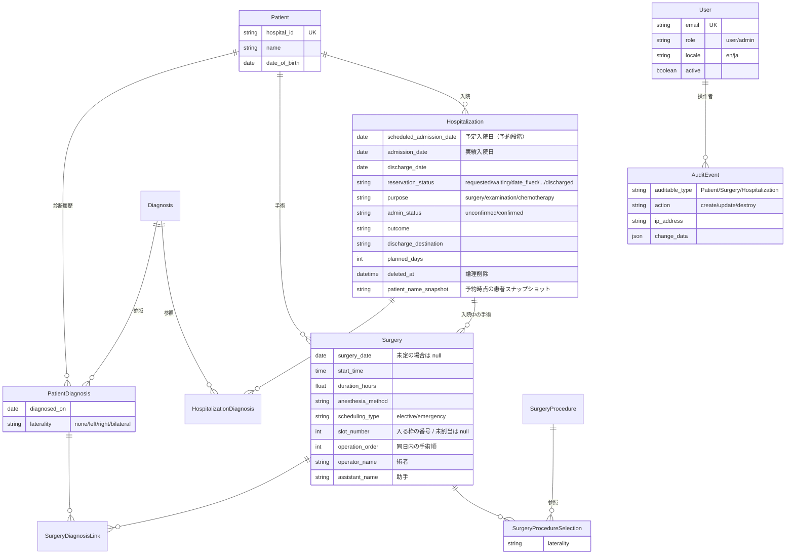

# Altocumulus

[](https://github.com/studiome/altocumulus/actions/workflows/ci.yml)
[](.ruby-version)
[](Gemfile)
[](LICENSE)

診療科単位で使う、患者・診断・手術・入院の診療台帳アプリケーション。
外来から病棟までの記録を 1 か所にまとめ、**手術枠（elective slot）の消化状況**・
**入院予約から確定までのライフサイクル**・**全変更の監査ログ**を、
ログインした利用者ごとの権限のもとで可視化することに重点を置いています。
既定 50 日分を見渡す**運用カレンダー**をトップページとして、日々の手術・入院件数や
混雑・休日・お知らせをひと目で確認できます。

Rails 8.1 の標準構成（Propshaft + importmap + Turbo/Stimulus）だけで作られており、
Node のビルドパイプラインも外部の DB サーバーも必要ありません。

---

## 目次

- [主な機能](#主な機能)
- [技術スタック](#技術スタック)
- [セットアップ](#セットアップ)
- [開発コマンド](#開発コマンド)
- [ドメインモデル](#ドメインモデル)
- [設計上のポイント](#設計上のポイント)
- [テスト](#テスト)
- [デプロイ](#デプロイ)
- [開発ルール](#開発ルール)
- [ライセンス](#ライセンス)

---

## 主な機能

| 機能 | 画面 | 概要 |
| --- | --- | --- |
| ログイン | `/login` | メールアドレス + パスワードによる認証。無操作が一定時間続くと自動的にセッションが失効 |
| 運用カレンダー（トップ） | `/operations_calendar` | 既定 50 日分の日別ビュー。手術・入院件数、混雑注意、休日/日別コメント、待機・直近更新・要確認などのサマリー、お知らせを一覧表示 |
| 患者台帳 | `/patients` | 患者基本情報の管理。氏名・患者 ID でのキーワード検索、ページネーション対応 |
| 患者診断 | `/patients/:id/patient_diagnoses` | 診断マスタを参照した患者ごとの診断履歴。診断日と左右区分（laterality）を保持 |
| 手術記録 | `/surgeries` | 手術日（「未定」も選択可）・術式（最大 5 件）・麻酔法・所要時間・予定/緊急区分・術者/助手/手術順。患者診断および入院と紐付け |
| 入院記録 | `/hospitalizations` | 予約段階（予定入院日）から実入院（実績入院日）・退院までのライフサイクル、入院目的、管理者確認、論理削除/復元、再予約（コピー）に対応 |
| 手術枠スケジュール | `/surgery_schedule` | 週表示のカレンダー。枠ごとの手術一覧と使用時間、枠の時間超過・未割当手術・祝日を警告表示 |
| ダッシュボード | `/dashboard` | 年次で絞り込める統計（患者数・在院患者数・月別件数・平均在院日数・術式ランキング） |
| 横断検索 | `/search` | キーワード 1 つで患者・入院・手術を横断的に検索 |
| 監査ログ | `/audit_events` | 患者・手術・入院の作成/更新/削除を、操作者・IP アドレス・変更前後の値つきで記録・閲覧 |
| マスタ管理 | `/diagnoses` `/surgery_procedures` `/elective_slot_rules` `/holidays` | 診断名・術式・曜日別の手術枠ルール（枠数は小数対応）・休日/日別コメント |
| アカウント設定 | `/account` | 自分の氏名・メールアドレス・パスワードの変更、表示言語の切り替え |
| 利用者管理（管理者専用） | `/admin/users` | 利用者の作成・編集・無効化、パスワード初期化。最後の有効な管理者は無効化・降格できない |
| お知らせ管理（管理者専用） | `/admin/announcements` | 運用カレンダーに表示するお知らせの作成・公開/非公開切り替え |
| 管理者メモ（管理者専用） | `/admin/admin_notes` | 管理者間の申し送り用フリーテキストメモ |

**認証・利用者管理・権限分離（一般/管理者）・アクセスログ・無操作タイムアウトを実装済みです。**
すべての画面はログインしたユーザーのみアクセスできます（`/login` を除く）。

## 技術スタック

| 領域 | 採用技術 |
| --- | --- |
| 言語 / フレームワーク | Ruby 4.0.6 / Rails 8.1 |
| データベース | SQLite（アプリ本体・Solid Queue・Solid Cache・Solid Cable の 4 スキーマ） |
| バックグラウンド処理 | Solid Queue / Solid Cache / Solid Cable |
| アセット | Propshaft + importmap-rails（**Node / バンドラ不使用**） |
| CSS | Tailwind CSS + daisyUI（`tailwindcss-rails`） |
| フロントエンド | Hotwire（Turbo Drive / Turbo Streams / Stimulus） |
| テスト | Minitest + fixtures、システムテストは Capybara + Selenium |
| 静的解析 | RuboCop（`rubocop-rails-omakase`）、Brakeman、bundler-audit、importmap audit |
| デプロイ | Kamal + Thruster（Dockerfile 同梱） |

## セットアップ

前提: Ruby 4.0.6（`.ruby-version` 参照）と Bundler。

```bash
git clone https://github.com/studiome/altocumulus.git
cd altocumulus
bin/setup
```

`bin/setup` は gem のインストール、DB の作成・マイグレーション・seed、ログの初期化を行い、
そのまま開発サーバーを起動します。サーバーを起動せずに準備だけしたい場合:

```bash
bin/setup --skip-server
```

以降の起動は `bin/dev` を使います（`Procfile.dev` により Rails サーバーと Tailwind の
watcher が同時に立ち上がります）。

```bash
bin/dev
```

http://localhost:3000 でアクセスできます。ルートパスは運用カレンダー
（`OperationsCalendarController#index`）です。未ログインの場合はログイン画面へ
リダイレクトされます。

`bin/setup`（開発環境）は seed も実行し、以下のデモ管理者アカウントでログインできます
（`db/seeds.rb` 参照）。

| メールアドレス | パスワード |
| --- | --- |
| `admin@example.com` | `password` |

本番環境では、初回起動時に以下の環境変数を**両方**指定すると、ブートストラップ用の
管理者アカウント（名前は `Administrator`）が `db:seed` 実行時に作成されます。
既に同じメールアドレスのユーザーが存在する場合は何もしません。

| 環境変数 | 内容 |
| --- | --- |
| `BOOTSTRAP_ADMIN_EMAIL` | 初回管理者のメールアドレス |
| `BOOTSTRAP_ADMIN_PASSWORD` | 初回管理者のパスワード |

その他、以下の環境変数で挙動を調整できます（`config/application.rb`）。

| 環境変数 | 内容 | 既定値 |
| --- | --- | --- |
| `SESSION_IDLE_TIMEOUT_MINUTES` | セッションの無操作タイムアウト（分） | `10` |
| `ADMISSION_WARNING_THRESHOLD` | 運用カレンダーで「混雑注意」とする 1 日あたりの入院件数 | `5` |

## 開発コマンド

```bash
bin/dev                                        # 開発サーバー + Tailwind watcher
bin/rails test                                 # 全テスト（システムテストを除く）
bin/rails test test/models/patient_test.rb     # ファイル単位
bin/rails test test/models/patient_test.rb:12  # 行単位
bin/rails test:system                          # システムテスト（Selenium が必要）
bin/rails db:prepare                           # DB の作成・マイグレーション・seed
bin/rubocop                                    # Lint
bin/brakeman                                   # セキュリティ静的解析
bin/bundler-audit                              # 依存 gem の脆弱性監査
bin/ci                                         # CI と同じ一連のチェック（config/ci.rb）
```

`bin/ci` は setup → RuboCop → gem/importmap/Brakeman の各監査 → テスト → seed の
再実行までを通しで行います。GitHub Actions（`.github/workflows/ci.yml`）でも
同等のジョブが `main` への push と PR で実行されます。

## ドメインモデル



上記に加えて、`ElectiveSlotRule`（曜日別の枠数と 1 枠あたりの分数。枠数は小数可）、
`Holiday`（休日 / 日別コメント兼用）、`Announcement`（お知らせ）、`AdminNote`（管理者メモ）、
`AccessLog`（ログイン/ログアウト/タイムアウト/認証失敗の記録）があります。

主な制約:

- `Diagnosis` / `SurgeryProcedure` は `restrict_with_error`。使用中のマスタは削除できません。
- `Surgery` は術式を **1〜5 件**、重複なしで持ちます。紐付ける患者診断はその手術の患者のものに限られます。
  `surgery_date` は「未定」を選べ、その場合は `null` として保存されます。
- `Hospitalization` は診断が **1 件以上必須**、重複不可。予約段階では `scheduled_admission_date`
  のみで保存でき（`admission_date` は必須ではありません）、いずれか一方は必須です。実績入院日/
  予定入院日どちらか（実効入院日）を基準に、同一患者の入院期間の重複を禁止しています。
- `Hospitalization` の削除は論理削除（`deleted_at`）で、復元できます。一般利用者による更新は
  `admin_status` を強制的に `unconfirmed` に戻し、管理者のみが確認（`confirmed`）にできます。
- `Surgery` を入院に紐付ける場合、同一患者かつ手術日が入院期間内である必要があります。
- `Surgery#slot_number` / `#operation_order` は 1 以上の整数（未割当は `null`）。枠数の超過や
  枠時間の超過は保存をブロックせず、スケジュール盤・運用カレンダーの警告として表示されます。
- `User` は最後の有効な管理者を無効化・一般利用者へ降格できません（`cannot_deactivate_or_demote_last_admin`）。

## 設計上のポイント

### 手術枠（elective slot）の消化管理

**1 枠 = その日の手術室 1 部屋分の時間帯**です。1 枠には複数の手術（2〜3 件を想定）が入り、
枠に入っている手術の**所要時間の合計**が枠時間（`slot_duration_minutes`）を超えたときに、
その枠が超過として警告されます。判定は手術単位ではなく枠単位です。

手術がどの枠に入るかは `Surgery#slot_number` で明示的に指定します（自動割り当てはしません）。
枠番号が未設定、またはその日の枠数を超える番号を指している予定手術は、枠に入らず
「Not assigned to a slot」として盤の下部に表示されます。

祝日はその日の予定手術枠を無効化します。**緊急手術は枠ルールの対象外**で、枠の消化にも
警告にも影響しません。緊急手術に枠番号が付いた場合は保存を失敗させず、
`before_validation` で黙って消去します（緊急手術はいつでも保存できなければならないため）。

主なオブジェクト:

| 要素 | 役割 |
| --- | --- |
| `ElectiveSlotUsage` | 1 日分の枠の使用状況（PORO）。`slots` / `unscheduled_surgeries` / `warnings` を提供 |
| `ElectiveSlotUsage::Slot` | 1 枠。`surgeries` / `used_minutes` / `remaining_minutes` / `overrun?` / `overrun_minutes` |
| `ElectiveSlotRule` | 曜日ごとの枠数（`slot_count`）と 1 枠の分数（`slot_duration_minutes`） |

`ElectiveSlotUsage.for_dates` は日数によらず固定回数のクエリで週表示分・運用カレンダー分を
まとめて構築し、N+1 を避けています。

`slot_count` は **小数を許容**します（例: `2.5`）。整数部がそのまま「フル尺の枠」の数で、
端数は「その日の**最後の枠だけ短い**」ことを意味します（`ElectiveSlotRule#slot_durations` /
`#total_slots` 参照）。枠の総数を数えるときは `slot_count` そのものではなく必ず `total_slots`
（`slot_count.ceil`）を使います。`(1..slot_count)` のような Range は Ruby がフラクショナルな
終端を切り捨てるため、最後の短い枠を静かに落としてしまいます。

### 認証・権限・セッション管理

`has_secure_password`（bcrypt）によるログインで、ロールは `user` / `admin` の 2 種類です。
`ApplicationController` は全アクションの前に `require_login` を強制し（`/login` などログイン前
の画面のみ `skip_before_action` で除外）、`require_admin` を通した先だけが管理者専用の画面
（利用者管理・お知らせ管理・管理者メモ・入院の確認/復元/再予約）にアクセスできます。

セッションには最終アクセス時刻を保持し、`config.x.session_idle_timeout`
（既定 10 分、`SESSION_IDLE_TIMEOUT_MINUTES` で変更可）を超えて無操作だとセッションを
失効させ、`AccessLog` に `timeout` イベントを記録します。ログイン成功/失敗・ログアウトも
同様に `AccessLog`（IP アドレス・User-Agent・アクセス URL つき）へ記録されます。ログイン
失敗時はメールアドレスが存在しない場合と間違ったパスワードの場合を区別せず、`authenticate_by`
がダミーの BCrypt ハッシュ照合まで行うことで応答時間からも判別できないようにしています。

`User` には**最後の有効な管理者を無効化・一般利用者へ降格できない**バリデーションがあり、
管理者不在の状態に陥ることを防ぎます。

### 入院予約のライフサイクル

`Hospitalization` は「予約 → 確定 → 入院 → 退院」という時間軸を、実績日と予定日を分けて
表現します。

- 登録時点では `scheduled_admission_date`（予定入院日）だけで保存でき、`admission_date`
  （実績入院日）は未定でも構いません。両方とも空の場合のみ保存を拒否します。
- `reservation_status`（requested/waiting/date_fixed/surgery_date_fixed/admitted/
  admitted_other_dept/on_hold/discharged）で予約の進行状況を、`purpose`
  （surgery/examination/chemotherapy）で入院目的を表します。
- `admin_status`（unconfirmed/confirmed）は**一般利用者による更新のたびに強制的に
  unconfirmed へ戻り**、管理者だけが `confirm` アクションで confirmed にできます
  （`before_update :reset_admin_status_for_non_admin_update`）。コンソールや seed など
  `Current.user` がいない保存は対象外です。
- 削除は物理削除ではなく `deleted_at` による**論理削除**（`discard!` / `restore!`）で、
  削除済み一覧（`/hospitalizations/deleted`、管理者専用）から復元できます。
- `#rebook` は「別の予定入院日で撮り直す」ための**再予約（コピー）**を行い、実績・退院情報・
  管理者確認・手術の紐付けは引き継がず、診断だけを引き継いだ新規の `requested` レコードを
  作成します（`/hospitalizations/:id/copy`）。
- 登録時点の患者の氏名・年齢・性別を `patient_name_snapshot` などに**スナップショット**として
  保持し、後で患者情報が変わっても予約当時の記録が変わらないようにしています。

### ネストした複数行フォーム（診断ピッカー / 術式ピッカー）

`Hospitalization` と `Surgery` は `accepts_nested_attributes_for` を使い、複数の中間レコードを
1 回の送信で追加・削除します。対応する Stimulus コントローラが `<template>` を複製して行を
増やし、削除は DOM 構造を壊さずに `_destroy` の hidden フィールドを切り替えます。

Rails の `params.expect` は**数値キーのみ**をネスト属性のインデックスとして扱うため、
新規行には単調増加する数値（`Date.now()` ベース）を `child_index` に使う必要があります。

既存 2 行の値を入れ替えるような更新は、保存途中で一意インデックスに一時的に抵触し得るため、
コントローラ側で `ActiveRecord::RecordNotUnique` を捕捉してバリデーションエラーに変換しています。

### モーダルからのマスタ作成

診断名・術式は、入力中のフォームを離れずにモーダルから新規作成できます。作成成功時は
Turbo Stream で該当の `<select>` に新しい選択肢を差し込みます。

### 監査ログ

`Auditable` concern を `Patient` / `Surgery` / `Hospitalization` に include し、
作成・更新・削除を `AuditEvent` に記録します。`change_data` には変更前後の値を保存し、
`record_label` に各モデルの `to_s` を保存することで、レコード削除後も何が変わったかを追えます。
記録時点の `Current.user`（操作者）と `Current.ip_address`（リクエスト元 IP）も
あわせて保存されるため、「誰が」「どこから」変更したかまで追跡できます。

監査イベントの記録に失敗した場合は保存全体がロールバックされ、記録漏れが起きないようになっています。
`update_all` はコールバックを飛ばすため、入院削除時の手術の紐付け解除もレコード単位の保存で行っています。

### 日本語 / 英語の表示切り替え

ナビゲーションから日本語・英語をいつでも切り替えられます（既定は英語）。ログイン中は
`users.locale` に切り替え結果が永続化され、次回以降のログインでも引き継がれます。未ログイン
時は Cookie セッションに一時保存されます（`LocalesController`）。`params[:locale]` は
`I18n.available_locales` に含まれる値だけを受け付け、任意の文字列がそのまま `I18n.locale=`
に渡ることはありません。

**DB に格納される値（`outcome` / `reservation_status` / `purpose` / `role` など）は常に
英語のキーのままです。翻訳されるのは表示（ラベル）だけ**で、各モデルの `*_options` /
`*_form_options` メソッドが `I18n.t` でその場でラベルを引きます。これにより、後から
言語を切り替えても保存済みデータの意味が変わらず、キー自体の一覧管理も
`config/locales/*.yml` 側だけで完結します。

## テスト

Red/Green TDD で開発しています。テストは Minitest + fixtures。

```bash
bin/rails test          # モデル・コントローラ・結合テスト（システムテストを除く）
bin/rails test:system   # Capybara + Selenium
```

`test/` は `models` / `controllers` / `integration` / `system` / `helpers` / `views` に
分かれています。fixtures（`test/fixtures/`）には「1 枠に 2 手術が収まる日」「1 枠が時間超過する日」
「枠未割当の手術」を再現するデータが意図的に仕込まれているため、変更時はコメントを確認してください。

## デプロイ

Kamal + Thruster を使った Docker ベースのデプロイに対応しています（`Dockerfile`、
`config/deploy.yml`、`.kamal/`）。

```bash
bin/kamal setup     # 初回
bin/kamal deploy    # 以降
```

ヘルスチェックは `/up`（`rails/health#show`）で公開されています。

`BOOTSTRAP_ADMIN_EMAIL` / `BOOTSTRAP_ADMIN_PASSWORD` を設定しておくと、コンテナ起動時に
実行される `bin/docker-entrypoint` の `db:prepare`（DB を新規作成した場合は `db:seed` も
実行）を通じて、初回デプロイ時に最初の管理者アカウントが自動作成されます。
詳しくは[セットアップ](#セットアップ)を参照してください。

## 開発ルール

AI エージェントを含む開発フローの取り決めは以下にまとめています。

- [AGENTS.md](AGENTS.md) — エージェント共通のルール（日本語での応答、TDD、Git 運用）
- [CLAUDE.md](CLAUDE.md) — Claude Code 向けのリポジトリ固有ガイド

要点:

- 回答・報告は日本語、コミットメッセージは英語。
- Red/Green TDD。失敗するテストを先に書き、最小限の実装で通す。
- 原則 `main` へ直接コミット。PR は明示的な指示があるときだけ作成する。

## ライセンス

[MIT License](LICENSE) — Copyright (c) 2026 Kazuhiro Miyahara
