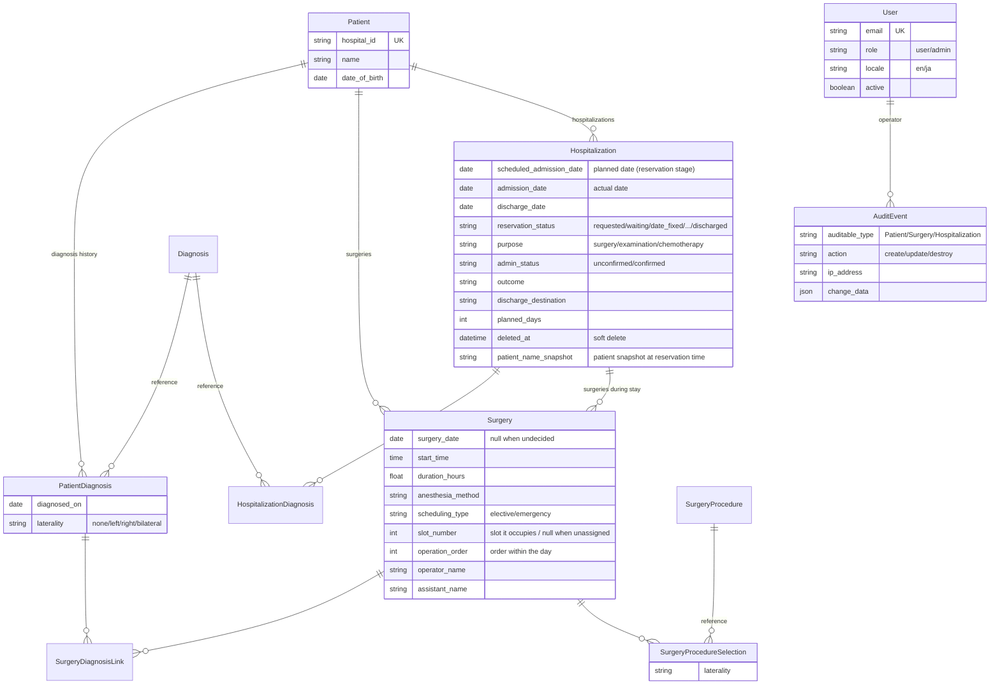

# Altocumulus

[](https://github.com/studiome/altocumulus/actions/workflows/ci.yml)
[](.ruby-version)
[](Gemfile)
[](LICENSE)

**English** | [日本語](README.ja.md)

A clinical ledger application for a single hospital department, tracking patients,
diagnoses, surgeries, and hospitalizations. It brings outpatient and ward records
together in one place, with a focus on making **elective slot utilization**, the
**lifecycle of a hospitalization from request to discharge**, and an **audit log of
every change** visible under per-user permissions. The landing page is an
**operations calendar** spanning 50 days by default, showing daily surgery and
admission counts, congestion warnings, holidays, and announcements at a glance.

It is built entirely on the stock Rails 8.1 stack (Propshaft + importmap +
Turbo/Stimulus) — no Node build pipeline and no external database server.

---

## Table of contents

- [Features](#features)
- [Tech stack](#tech-stack)
- [Setup](#setup)
- [Development commands](#development-commands)
- [Domain model](#domain-model)
- [Design notes](#design-notes)
- [Testing](#testing)
- [Deployment](#deployment)
- [Development rules](#development-rules)
- [License](#license)

---

## Features

| Feature | Screen | Description |
| --- | --- | --- |
| Login | `/login` | Email + password authentication. Sessions expire automatically after a period of inactivity |
| Operations calendar (home) | `/operations_calendar` | Day-by-day view spanning 50 days by default. Surgery and admission counts, congestion warnings, holidays / per-day comments, summaries (waiting, recently updated, needs attention), and announcements |
| Patient ledger | `/patients` | Patient master data, with keyword search by name or hospital ID and pagination |
| Patient diagnoses | `/patients/:id/patient_diagnoses` | Per-patient diagnosis history referencing the diagnosis master, holding the diagnosis date and laterality |
| Surgery records | `/surgeries` | Surgery date (may be "undecided"), procedures (up to 5), anesthesia method, duration, elective/emergency type, operator/assistant/operation order. Linked to patient diagnoses and hospitalizations |
| Hospitalization records | `/hospitalizations` | Lifecycle from reservation (scheduled admission date) through actual admission and discharge, admission purpose, administrator confirmation, soft delete/restore, and rebooking (copy) |
| Surgery slot schedule | `/surgery_schedule` | Weekly calendar showing the surgeries and used time per slot, warning about slot overruns, unassigned surgeries, and holidays |
| Dashboard | `/dashboard` | Statistics filterable by year (patient counts, inpatients, monthly counts, average length of stay, procedure ranking) |
| Cross-entity search | `/search` | Search patients, hospitalizations, and surgeries with a single keyword |
| Audit log | `/audit_events` | Records and displays create/update/delete of patients, surgeries, and hospitalizations with the operator, IP address, and before/after values |
| Master data | `/diagnoses` `/surgery_procedures` `/elective_slot_rules` `/holidays` | Diagnosis names, procedures, per-weekday slot rules (fractional slot counts supported), holidays / per-day comments |
| Account settings | `/account` | Change your own name, email, and password, and switch the display language |
| User management (admin only) | `/admin/users` | Create, edit, and deactivate users and reset passwords. The last active admin can be neither deactivated nor demoted |
| Announcement management (admin only) | `/admin/announcements` | Create announcements shown on the operations calendar and toggle their visibility |
| Admin notes (admin only) | `/admin/admin_notes` | Free-text handover notes shared between administrators |

**Authentication, user management, role separation (user/admin), access logging, and
idle timeout are implemented.** Every application screen requires a logged-in user; the
exceptions are `/login`, the language switcher (`PATCH /locale`), and the `/up` health check.

## Tech stack

| Area | Technology |
| --- | --- |
| Language / framework | Ruby 4.0.6 / Rails 8.1 |
| Database | SQLite (four schemas: the app itself, Solid Queue, Solid Cache, Solid Cable) |
| Background processing | Solid Queue / Solid Cache / Solid Cable |
| Assets | Propshaft + importmap-rails (**no Node, no JS bundler**) |
| CSS | Tailwind CSS + daisyUI (`tailwindcss-rails`) |
| Front end | Hotwire (Turbo Drive / Turbo Streams / Stimulus) |
| Testing | Minitest + fixtures; system tests with Capybara + Selenium |
| Static analysis | RuboCop (`rubocop-rails-omakase`), Brakeman, bundler-audit, importmap audit |
| Deployment | Kamal + Thruster (Dockerfile included) |

## Setup

Prerequisites: Ruby 4.0.6 (see `.ruby-version`) and Bundler.

```bash
git clone https://github.com/studiome/altocumulus.git
cd altocumulus
bin/setup
```

`bin/setup` installs gems, creates/migrates/seeds the database, clears logs, and then
starts the development server. To prepare everything without starting the server:

```bash
bin/setup --skip-server
```

After that, use `bin/dev` (via `Procfile.dev` it runs the Rails server and the Tailwind
watcher together).

```bash
bin/dev
```

The app is available at http://localhost:3000. The root path is the operations calendar
(`OperationsCalendarController#index`); unauthenticated visitors are redirected to the
login screen.

In development, `bin/setup` also runs the seeds, so you can log in with the following
demo administrator account (see `db/seeds.rb`).

| Email | Password |
| --- | --- |
| `admin@example.com` | `password` |

In production, setting **both** of the environment variables below on first boot creates
a bootstrap administrator account (named `Administrator`) when `db:seed` runs. If a user
with the same email already exists, nothing happens.

| Environment variable | Description |
| --- | --- |
| `BOOTSTRAP_ADMIN_EMAIL` | Email of the first administrator |
| `BOOTSTRAP_ADMIN_PASSWORD` | Password of the first administrator |

The following environment variables tune runtime behavior (`config/application.rb`).

| Environment variable | Description | Default |
| --- | --- | --- |
| `SESSION_IDLE_TIMEOUT_MINUTES` | Session idle timeout, in minutes | `10` |
| `ADMISSION_WARNING_THRESHOLD` | Admissions per day above which the operations calendar flags congestion | `5` |

## Development commands

```bash
bin/dev                                        # dev server + Tailwind watcher
bin/rails test                                 # all tests except system tests
bin/rails test test/models/patient_test.rb     # a single file
bin/rails test test/models/patient_test.rb:12  # a single test at a line
bin/rails test:system                          # system tests (requires Selenium)
bin/rails db:prepare                           # create / migrate / seed the database
bin/rubocop                                    # lint
bin/brakeman                                   # static security analysis
bin/bundler-audit                              # audit gems for known vulnerabilities
bin/ci                                         # the same checks CI runs (config/ci.rb)
```

`bin/ci` runs setup → RuboCop → the gem/importmap/Brakeman audits → tests → a re-run of
the seeds. GitHub Actions (`.github/workflows/ci.yml`) runs an equivalent job on pushes
to `main` and on pull requests.

## Domain model



In addition to the above there are `ElectiveSlotRule` (per-weekday slot count and minutes
per slot; the count may be fractional), `Holiday` (holidays and per-day comments),
`Announcement`, `AdminNote`, and `AccessLog` (login/logout/timeout/failed authentication).

Key constraints:

- `Diagnosis` / `SurgeryProcedure` use `restrict_with_error`: master records in use cannot be deleted.
- A `Surgery` holds **1–5 procedures** with no duplicates. Linked patient diagnoses must belong
  to that surgery's patient. `surgery_date` may be "undecided", in which case it is stored as `null`.
- A `Hospitalization` requires **at least one diagnosis**, with no duplicates. At the reservation
  stage it can be saved with only `scheduled_admission_date` (`admission_date` is not required),
  but at least one of the two must be present. Overlapping stays for the same patient are rejected
  based on whichever date is effective (actual, otherwise scheduled).
- Deleting a `Hospitalization` is a soft delete (`deleted_at`) and can be undone. An update by a
  regular user forcibly resets `admin_status` to `unconfirmed`; only an administrator can set it
  to `confirmed`.
- To link a `Surgery` to a hospitalization, both must belong to the same patient and the surgery
  date must fall within the stay.
- `Surgery#slot_number` / `#operation_order` are integers of 1 or more (`null` when unassigned).
  Exceeding the slot count or a slot's time budget does not block saving; it surfaces as a warning
  on the schedule board and the operations calendar.
- A `User` cannot deactivate or demote the last active administrator
  (`cannot_deactivate_or_demote_last_admin`).

## Design notes

### Elective slot utilization

**One slot = one operating room's time block for that day.** A slot holds several surgeries
(2–3 are expected), and the slot is flagged as an overrun when the **sum of the durations** of
the surgeries in it exceeds the slot duration (`slot_duration_minutes`). The check is per slot,
not per surgery.

Which slot a surgery occupies is stated explicitly via `Surgery#slot_number` — there is no
automatic assignment. An elective surgery with no slot number, or one pointing past that day's
slot count, does not enter a slot and is listed under "Not assigned to a slot" at the bottom of
the board.

A holiday disables that day's elective slots. **Emergency surgeries are outside the slot rules**
and affect neither utilization nor warnings. If an emergency surgery is given a slot number, the
save is not rejected: `before_validation` silently clears it, because an emergency surgery must
always be saveable.

Main objects:

| Element | Role |
| --- | --- |
| `ElectiveSlotUsage` | Slot usage for one day (a PORO). Provides `slots` / `unscheduled_surgeries` / `warnings` |
| `ElectiveSlotUsage::Slot` | A single slot. `surgeries` / `used_minutes` / `remaining_minutes` / `overrun?` / `overrun_minutes` |
| `ElectiveSlotRule` | Per-weekday slot count (`slot_count`) and minutes per slot (`slot_duration_minutes`) |

`ElectiveSlotUsage.for_dates` builds a whole week's — or the whole operations calendar's — worth
of usage with a fixed number of queries regardless of the day count, avoiding N+1.

`slot_count` **allows fractions** (e.g. `2.5`). The integer part is the number of full-length
slots, and the fraction means **only the last slot of the day is shorter**
(see `ElectiveSlotRule#slot_durations` / `#total_slots`). When counting slots, always use
`total_slots` (`slot_count.ceil`) rather than `slot_count` itself: a range such as
`(1..slot_count)` silently drops the last short slot, because Ruby truncates a fractional endpoint.

### Authentication, authorization, and sessions

Login uses `has_secure_password` (bcrypt), with two roles: `user` and `admin`.
`ApplicationController` enforces `require_login` before every action (only pre-login screens such
as `/login` opt out via `skip_before_action`), and `require_admin` gates the admin-only screens
(user management, announcement management, admin notes, and hospitalization
confirm/restore/rebook).

The session stores the time of last access; going longer than `config.x.session_idle_timeout`
(10 minutes by default, configurable via `SESSION_IDLE_TIMEOUT_MINUTES`) without activity expires
the session and records a `timeout` event in `AccessLog`. Successful and failed logins and logouts
are recorded the same way (with IP address, User-Agent, and requested URL). A failed login does not
distinguish between an unknown email and a wrong password, and `authenticate_by` performs a dummy
BCrypt comparison so the two cannot be told apart by response time either.

`User` also validates that **the last active administrator cannot be deactivated or demoted**,
preventing the system from ending up with no administrator.

### Hospitalization reservation lifecycle

`Hospitalization` models the "reserved → fixed → admitted → discharged" timeline by keeping actual
and planned dates apart.

- On creation it can be saved with only `scheduled_admission_date`; `admission_date` may still be
  undecided. Only when both are blank is the save rejected.
- `reservation_status` (requested/waiting/date_fixed/surgery_date_fixed/admitted/
  admitted_other_dept/on_hold/discharged) tracks the reservation's progress, and `purpose`
  (surgery/examination/chemotherapy) the reason for admission.
- `admin_status` (unconfirmed/confirmed) is **forced back to unconfirmed on every update by a
  regular user**; only an administrator can set it to confirmed via the `confirm` action
  (`before_update :reset_admin_status_for_non_admin_update`). Saves without a `Current.user`
  (console, seeds) are exempt.
- Deletion is a **soft delete** via `deleted_at` (`discard!` / `restore!`) rather than a physical
  one, and records can be restored from the deleted list (`/hospitalizations/deleted`, admin only).
- `#rebook` performs a **rebooking (copy)** for "take this again on a different planned date": it
  creates a new `requested` record carrying over only the diagnoses, dropping the actual dates,
  discharge information, administrator confirmation, and surgery links
  (`/hospitalizations/:id/copy`).
- The patient's name, age, and sex at the time of reservation are kept as a **snapshot**
  (`patient_name_snapshot` and friends), so later changes to the patient do not alter the record
  as it stood then.

### Nested multi-row forms (diagnosis / procedure pickers)

`Hospitalization` and `Surgery` use `accepts_nested_attributes_for` to add and remove several join
records in a single submit. The matching Stimulus controllers clone a `<template>` to add rows, and
removal toggles a hidden `_destroy` field without disturbing the DOM structure the server rendered.

Because Rails' `params.expect` treats **only numeric keys** as nested-attribute indices, newly added
rows must use a monotonically increasing number (based on `Date.now()`) as their `child_index`.

An update that swaps the values of two existing rows can transiently violate a unique index
mid-save, so the controllers rescue `ActiveRecord::RecordNotUnique` and turn it into a validation
error.

### Creating master records from a modal

Diagnosis names and procedures can be created from a modal without leaving the form being filled
in. On success, a Turbo Stream splices the new option into the relevant `<select>`.

### Audit log

The `Auditable` concern is included in `Patient` / `Surgery` / `Hospitalization` and records
creates, updates, and deletes as `AuditEvent`s. `change_data` stores the before/after values and
`record_label` stores each model's `to_s`, so a change remains traceable even after the record is
deleted. The `Current.user` (operator) and `Current.ip_address` (request origin) at the time of the
change are stored as well, so it is clear "who" changed something and "from where".

If recording an audit event fails, the whole save is rolled back, so nothing goes unrecorded.
Because `update_all` skips callbacks, unlinking surgeries when a hospitalization is deleted is done
with per-record saves.

### Switching between Japanese and English

The language can be switched between Japanese and English at any time from the navigation
(English is the default). While logged in, the choice is persisted to `users.locale` and carried
over to later logins; when logged out it is kept temporarily in the cookie session
(`LocalesController`). `params[:locale]` only accepts values contained in `I18n.available_locales`,
so an arbitrary string is never passed straight to `I18n.locale=`.

**Values stored in the database (`outcome` / `reservation_status` / `purpose` / `role`, and so on)
always stay as English keys. Only the display labels are translated** — each model's `*_options` /
`*_form_options` methods look the labels up through `I18n.t` on the spot. As a result, switching
languages later never changes the meaning of stored data, and the list of keys is maintained
entirely in `config/locales/*.yml`.

## Testing

Development follows Red/Green TDD. Tests are Minitest + fixtures.

```bash
bin/rails test          # model, controller, and integration tests (no system tests)
bin/rails test:system   # Capybara + Selenium
```

`test/` is split into `models` / `controllers` / `integration` / `system` / `helpers` / `views`.
The fixtures (`test/fixtures/`) deliberately encode cases such as "a day where two surgeries fit in
one slot", "a day where one slot overruns", and "a surgery with no slot assigned", so check the
comments before changing them.

## Deployment

Docker-based deployment with Kamal + Thruster is supported (`Dockerfile`, `config/deploy.yml`,
`.kamal/`).

```bash
bin/kamal setup     # first time
bin/kamal deploy    # afterwards
```

The health check is exposed at `/up` (`rails/health#show`).

If `BOOTSTRAP_ADMIN_EMAIL` / `BOOTSTRAP_ADMIN_PASSWORD` are set, the first administrator account is
created automatically on the first deploy, through the `db:prepare` (plus `db:seed` when the
database is created fresh) run by `bin/docker-entrypoint` at container start. See [Setup](#setup)
for details.

## Development rules

The conventions for the development flow, including AI agents, are documented here.

- [AGENTS.md](AGENTS.md) — shared rules for agents (replies in Japanese, TDD, Git workflow)
- [CLAUDE.md](CLAUDE.md) — repository-specific guidance for Claude Code

In short:

- Answers and reports in Japanese; commit messages in English.
- Red/Green TDD: write a failing test first, then the minimum implementation to pass it.
- Commit directly to `main` as a rule; open a pull request only when explicitly asked.

## License

[MIT License](LICENSE) — Copyright (c) 2026 Kazuhiro Miyahara
